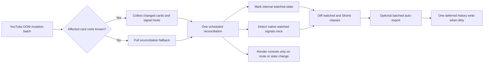

# Subscription Filtering Speed - Plan

**Target subtree:** `mark-watched-extension`

## Goal Capsule

- **Objective:** Reduce the time between a YouTube Subscriptions card becoming available and the Mark Watched extension applying its watched-video visibility state.
- **Authority:** The user request defines the outcome. The Product Contract below defines the behavior that must remain stable. Existing source and browser fixtures define the current compatibility surface.
- **Execution profile:** Performance-focused browser change with characterization coverage before optimization and a real-browser smoke check after implementation.
- **Stop conditions:** Do not change watched detection semantics, section scoping, or the class-based hide/dim behavior. Do not touch unrelated extension subtrees or unrelated dirty work in the monorepo.
- **Tail ownership:** The calling LFG pipeline owns review, landing, pull request creation, and CI follow-up after implementation returns.

---

## Product Contract

### Summary

This plan makes watched-video filtering responsive on the lazy-rendered YouTube Subscriptions page by reconciling only affected cards and coalescing related DOM work. It retains a full reconciliation fallback for navigation, ambiguous mutations, and recovery.

### Problem Frame

`mark-watched-extension/src/content.js` observes the whole YouTube document and uses a 250 ms debounce before each mutation response. The mutation records only decide whether to run; the response then rescans all video cards, all watched-progress signals, all Shorts containers, and the header controls. The watched-signal detector is also called twice in one update, and auto-import can trigger another full pass.

YouTube progressively renders and reuses subscription cards. This makes repeated full-page scans both visible to the user and increasingly expensive as more cards accumulate. The current browser tests assert final visibility but do not characterize late card insertion, mutation bursts, scan work, or storage writes.

### Requirements

#### Filtering latency and lazy rendering

- R1. Already-rendered watched cards must receive their current dimmed or hidden state in the first scheduled reconciliation after the relevant DOM batch is available, without a deliberate fixed 250 ms wait for each batch.
- R2. Cards appended or hydrated later by YouTube must be processed continuously, including modern `yt-lockup-view-model` cards, without requiring a full-document scan for every known card mutation.
- R3. A burst of related card insertions or attribute changes must coalesce into bounded work rather than enqueueing one independent reconciliation per mutation.

#### Behavior compatibility

- R4. Internal history membership, YouTube progress-bar signals, explicit watched badges, legacy card renderers, modern card renderers, and the existing positive-progress behavior must continue to produce the same watched classification.
- R5. The Subscriptions visibility state must remain independent from the shared rest-of-YouTube state, and visibility toggles must continue to reconcile existing cards immediately.
- R6. Watched and Shorts visibility must remain reversible class-based presentation changes; this work must not physically remove YouTube card nodes from the DOM.

#### Work and persistence bounds

- R7. A normal known-root mutation batch must avoid redundant full-document card scans, duplicate watched-signal scans, unnecessary global class clearing, and unnecessary header reconstruction.
- R8. Auto-import must preserve the existing batched history semantics and must not write unchanged history solely because an unrelated DOM mutation occurred.
- R9. The implementation must add no runtime dependency and must preserve current extension behavior outside the targeted filtering path.

### Success Criteria

- A synthetic 100-card lazy-render batch reaches the expected hidden state with a p95 mutation-to-hidden latency of 100 ms or less in the Playwright fixture.
- The same batch performs at most one scheduled reconciliation and no full-document fallback when all affected roots are identifiable.
- Initial load, route changes, visibility toggles, unknown mutation shapes, and recovery paths retain a full-reconciliation fallback.
- Existing hiding tests remain green with no page errors, and new tests cover late cards, mutation bursts, href replacement, native watched signals, and storage-write coalescing.

### Scope Boundaries

In scope:

- The content script's DOM scheduling, affected-card reconciliation, watched-signal reuse, class-diff application, header-render guard, and history-write coordination.
- Playwright fixtures and tests for dynamic Subscriptions-like rendering and measurable filtering work.

#### Deferred to Follow-Up Work

- Changing the definition of watched progress or the current threshold semantics.
- Reworking YouTube's card selectors beyond the selectors required to preserve current coverage.
- Network prefetching, YouTube API usage, or changes to the summary overlay extension.

Outside this change:

- Physical DOM deletion, a new filtering UI, changes to history retention policy, and modifications to other Chromium extension projects.

---

## Planning Contract

### Key Technical Decisions

- KTD1. Extend the existing MutationObserver path with affected-root reconciliation and retain a fail-closed full-document fallback. Any unknown card, link, signal, or renderer shape makes the batch ambiguous and invokes the fallback; a known ancestor is not sufficient evidence that the incremental path is safe.
- KTD2. Use one frame-bounded scheduler for each burst, with a browser-safe timer fallback when animation-frame scheduling is unavailable. This replaces the current fixed per-batch delay with coalesced work close to the next paint.
- KTD3. Canonicalize nested legacy and modern renderers to one logical card root, then compute watched-signal containers once per reconciliation and share the result with class application and auto-import. Incremental updates must diff desired classes per affected card; full clearing remains limited to scope changes and fallback recovery.
- KTD4. Keep `watchedVideos.entries` as the canonical membership index and use a per-card cache only for repeated video-ID extraction. Do not add a second global ID index unless measurements prove the existing object is insufficient.
- KTD5. Keep history writes off the ordinary mutation hot path. Mark history dirty when auto-import changes data and persist one serialized snapshot for the batch, while preserving the existing explicit-save paths. A serialized, generation-aware writer snapshots the latest merged membership, clears dirty state only after that snapshot succeeds, and gives explicit restore/toggle writes precedence over deferred mutation writes.
- KTD6. Keep the existing class-based hiding and dimming mechanism. CSS hiding is reversible and avoids fighting YouTube's virtualized list ownership; physical node removal is not part of this optimization.
- KTD7. Use set-backed de-duplication for Shorts containers and treat extension-owned button mutations as non-feed work. This removes avoidable quadratic accumulation and prevents control rerenders from feeding the page observer.
- KTD8. Make reconciliation single-flight. While a pass is active, merge new affected roots and full-fallback flags into pending work; run one follow-up pass after the active pass completes, and version the pass so an older result cannot overwrite a newer explicit state change.
- KTD9. Make storage failure fail-soft and recoverable: retain the in-memory membership and dirty flag after a write failure, keep the scheduler runnable, retry at a bounded later full or explicit reconciliation, use the last readable state after a read failure, and never let an earlier deferred snapshot outrank an explicit restore/toggle save.
- KTD10. Observe the exact native-signal attributes consumed by the current detectors (`href`, `style`, `class`, `aria-valuenow`, `aria-valuemax`, and `overlay-style`), map each signal host to one logical card root, ignore extension-owned mutations, and route unknown records to the fail-closed fallback.

### High-Level Technical Design

The observer will collect added nodes, changed links, and relevant signal hosts into a pending set. The scheduler will consume that set once per frame, process only fail-closed resolvable roots, and use full reconciliation for initial load, navigation, visibility-state changes, restore/import, or ambiguous records. If a pass is active, new roots and fallback flags remain pending until that pass finishes. The reconciliation result will be shared by class application and auto-import so the same document is not scanned twice.

Reconciliation invariants:

- A card-only batch uses per-card desired-state diffs; global watched/Shorts class cleanup is allowed only for scope-changing passes and fail-closed fallback recovery. Other full-reconciliation triggers still process the full document but do not clear unrelated classes unless the active scope changed.
- An incremental pass is considered complete only after any imported IDs have been merged and the latest class state has been applied. A second batch arriving during an async import or write schedules a follow-up pass rather than racing the active one.
- A write snapshot carries the current history generation. A successful write clears dirty state only if no newer generation exists; a failed write retains dirty state and schedules one bounded retry path.

### Assumptions

- YouTube's lazy rendering and renderer names may continue to change, so the fallback path remains a correctness boundary rather than an exceptional dead end.
- The current dirty worktree is the implementation baseline; the change must layer on top of the existing `mark-watched-extension` edits without reverting them.
- Fixture timing measures extension scheduling and DOM work, not network latency. Live browser verification remains necessary for the actual signed-in Subscriptions surface.
- The existing positive-progress behavior, including the current fixture's low-progress watched card, is intentional compatibility behavior for this change and will not be retuned.

### Sequencing

1. Before changing production code, record a baseline from the existing fixture for late insertion, a 100-card mutation burst, full-card scans, native-signal scans, and storage writes. Keep this characterization as the comparison point for U1-U3.
2. Implement the affected-root scheduler and incremental card path.
3. Reuse one signal result, guard class updates and header rendering, and coordinate single-flight, generation-aware history writes.
4. Extend the browser fixtures with dynamic batches and performance counters, then run the existing and new behavior tests and compare them with the baseline.

### System-Wide Impact

- **YouTube page lifecycle:** The content script still responds to initial load, SPA navigation, focus changes, YouTube service events, XHR/fetch list updates, and body mutations. Each lifecycle source must route through the same coalesced scheduler.
- **Visibility state:** Scope detection and state toggles remain authoritative. A state change can request a full reconciliation, while a card-only mutation uses the incremental path.
- **History persistence:** Auto-import and explicit history operations share the same in-memory state. Dirty-state coordination must not lose imported IDs or suppress explicit saves.
- **Browser compatibility:** The design uses native DOM APIs already used by the extension and must remain compatible with the current Chrome/Safari-oriented content-script surface.

### Risks and Dependencies

- **YouTube DOM churn:** A renderer may be added outside the known card roots. Mitigation: preserve a full fallback for unclassified mutation records and keep modern/legacy selectors covered by fixtures.
- **Virtualized-card reuse:** YouTube may replace an anchor's `href` inside an existing card. Mitigation: invalidate the per-card extraction cache on link changes and test href replacement.
- **State race:** Auto-import may complete after a class pass. Mitigation: apply the imported result through the same reconciliation and keep the final class update synchronous after the batch write.
- **Overlapping lifecycle work:** A navigation, toggle, or restore can arrive while an incremental import is active. Mitigation: single-flight reconciliation plus generation-aware, serialized history writes; explicit operations advance the generation and take precedence.
- **Storage failure:** A mocked or real storage write can fail after in-memory import. Mitigation: retain the dirty snapshot, keep future scheduling live, and exercise bounded retry plus explicit-save precedence in the fixture.
- **Timing flake:** Browser scheduling varies across machines. Mitigation: wait on observable hidden state, record bounded latency, and keep the performance threshold generous enough to distinguish the old fixed debounce from normal frame work.

### Sources and Research

- `mark-watched-extension/src/content.js:65-98` — current document-wide card processor and selector coverage.
- `mark-watched-extension/src/content.js:703-795` — watched-signal detection, video-ID extraction, and batched auto-import.
- `mark-watched-extension/src/content.js:881-917` — current class clearing, watched/Shorts updates, and duplicate signal scan.
- `mark-watched-extension/src/content.js:1094-1147` — current 250 ms debounce and document-body observer.
- `mark-watched-extension/tests/test_watched_hiding.py:18-75` — existing Playwright fixture/test pattern and current final-visibility assertions.
- `docs/solutions/integration-issues/youtube-summary-caption-track-native-index.md` — adjacent YouTube integration learning; it reinforces validating actual browser-visible behavior rather than relying only on stored state.
- No external research was used because the target uses established browser primitives and the repository contains the relevant implementation and test patterns.

---

## Implementation Units

### U1. Incremental mutation scheduler and card reconciliation

- **Goal:** Make known card additions and href changes reconcile at frame-bounded latency without rescanning the complete page.
- **Requirements:** R1, R2, R3, R4, R6, R7.
- **Dependencies:** None.
- **Files:** `mark-watched-extension/src/content.js`; `mark-watched-extension/tests/watched-hiding-fixture.html`; `mark-watched-extension/tests/test_watched_hiding.py`.
- **Approach:**
  1. Convert mutation records into a deduplicated set of affected video-card roots and watched-signal hosts.
  2. Schedule one reconciliation for the pending set per frame, with a timer fallback.
  3. Process only fail-closed resolvable roots with the existing legacy and modern selector coverage; an unknown renderer or signal nested inside a known ancestor marks the whole batch ambiguous.
  4. Route initial load, navigation, visibility toggles, restore/import, and ambiguous mutations through full reconciliation.
  5. Observe `href`, `style`, `class`, `aria-valuenow`, `aria-valuemax`, and `overlay-style` changes used by native watched detectors; map each host to its canonical card root and ignore extension-owned class/control mutations.
  6. Invalidate cached card identity when a card's video link changes.
- **Patterns to follow:** Preserve the current `processAllVideoItems()` selector list, `extractVideoIdFromContainer()` fallback order, and class-based visibility CSS.
- **Test scenarios:**
  - A watched legacy card appended after the initial pass becomes hidden on the Subscriptions fixture without a fixed 250 ms debounce.
  - A watched modern `yt-lockup-view-model` card appended after navigation becomes hidden through the incremental path.
  - A burst of 100 appended cards is coalesced into one scheduled reconciliation and all watched cards become hidden.
  - An existing card whose thumbnail `href` changes from an unwatched ID to a watched ID is reclassified and hidden.
  - An unrelated body mutation does not prevent already-filtered cards from remaining hidden and does not force a full fallback when no card root is involved.
  - An ambiguous mutation still triggers the fallback and hides pre-existing watched cards.
  - A renderer or selector drift nested inside a known ancestor is treated as ambiguous and uses the fallback rather than silently skipping the card.
  - The same late insertion and href-reuse cases pass when the active watched presentation is dimmed, including removal of the dim class when the card becomes unwatched; hidden mode remains covered as well.
  - The modern-card append occurs only after the navigation-triggered full pass completes, and its counters show incremental handling with no full fallback.
- **Verification:** The dynamic fixture reports the number of scheduled reconciliations and the mutation-to-hidden latency; the existing outside-Subscriptions and Subscriptions visibility tests remain green with no page errors.

### U2. Reuse watched signals and coordinate class, UI, and history updates

- **Goal:** Remove duplicate work inside each reconciliation and keep storage and control rendering off the ordinary mutation hot path.
- **Requirements:** R4, R5, R6, R7, R8, R9.
- **Dependencies:** U1.
- **Files:** `mark-watched-extension/src/content.js`; `mark-watched-extension/tests/performance-fixture.html`; `mark-watched-extension/tests/test_watched_performance.py`.
- **Approach:**
  1. Compute the native watched-container result once and share it with class application and auto-import.
  2. Apply watched and Shorts classes by desired-state diff for incremental roots. Use global watched/Shorts cleanup only for scope-changing or fail-closed fallback-recovery passes; other full passes process all roots without clearing unrelated scope classes. Use constant-time Shorts de-duplication.
  3. Keep the header control DOM stable for card-only mutations, ignore extension-owned mutations, and rerender it only when route, scope, or button state changes.
  4. Mark history dirty when auto-import adds IDs and persist one latest-generation batch snapshot without writing unchanged history. Serialize overlapping imports and writes; retain dirty state after failure, retry once through a bounded later reconciliation, and keep explicit restore/toggle saves authoritative.
  5. Preserve explicit toggle, restore, backup, focus, and navigation paths that intentionally load or save history, and merge any mutations arriving while those operations are active into a follow-up pass.
- **Patterns to follow:** Preserve `watchedVideos.entries` as the membership source, the existing batched `noSave=true` auto-import behavior, and the current scope-key migration logic.
- **Test scenarios:**
  - A watched progress-bar host is detected once for a reconciliation and its card is both hidden and eligible for auto-import.
  - A batch containing multiple native watched signals causes one history write after import, not one write per card or one write for an unrelated mutation.
  - A large Shorts shelf is de-duplicated without quadratic array membership work, and its visibility state remains unchanged.
  - A card-only mutation leaves the existing header controls in place while a visibility toggle still rerenders or reconciles the controls as needed.
  - A navigation and visibility-toggle transition updates the existing header control to the active section/state, while a card-only mutation preserves its DOM identity.
  - Subscriptions hidden state and rest-of-YouTube state continue to produce their existing independent results after incremental and full passes.
  - A storage read failure uses the last readable state, and a write failure retains the in-memory history and dirty flag, retries once on a bounded later pass, and yields to an explicit restore/toggle save; no page errors or permanently suppressed reconciliation occur.
  - Two overlapping auto-import batches preserve every imported ID and produce one final canonical snapshot; an older snapshot cannot overwrite a newer generation.
- **Verification:** Instrumented fixture counters show no duplicate native-signal scan for one pass, no unchanged-history write for an unrelated mutation, and stable control markup across card-only updates.

### U3. Dynamic and performance regression coverage

- **Goal:** Make the speed improvement and lazy-render compatibility repeatable in the existing Playwright harness.
- **Requirements:** R1, R2, R3, R4, R5, R7, R8.
- **Dependencies:** U1, U2.
- **Files:** `mark-watched-extension/tests/performance-fixture.html`; `mark-watched-extension/tests/test_watched_performance.py`; `mark-watched-extension/tests/test_watched_hiding.py`.
- **Approach:**
  1. Extend the fixture harness with deterministic storage counters and a synthetic subscription-like feed.
  2. Add late-render, href-reuse, progress-signal, unrelated-mutation, and burst-insertion cases.
  3. Measure observable mutation-to-hidden latency and reconciliation/selector/storage counters instead of depending only on a fixed sleep.
  4. Keep the existing final-visibility tests as compatibility coverage for both section scopes and renderer generations.
- **Patterns to follow:** Use Python `unittest`, Playwright's bundled Chromium, mocked `chrome.storage.local`, `pageerror` collection, and computed `display` assertions already established in `test_watched_hiding.py`.
- **Test scenarios:**
  - A 100-card batch has p95 mutation-to-hidden latency at or below 100 ms in the fixture.
  - The 100-card batch has at most one scheduled reconciliation and no full-document fallback when all roots are known.
  - A late modern renderer and a low-progress native signal retain the current hidden result.
  - The same late-render and href-reuse cases retain the current dimmed result, and reversible class removal is asserted.
  - A section transition from the rest-of-YouTube fixture to the Subscriptions fixture preserves the independent visibility state.
  - All scenarios finish without page errors and without uncaught promise rejections.
- **Verification:** Run the existing hiding test and the new performance test from `mark-watched-extension`; run JavaScript syntax validation; then perform browser smoke verification on the signed-in YouTube Subscriptions page through the pipeline's browser-testing stage.

---

## Verification Contract

| Gate | Scope | Done signal |
|---|---|---|
| Syntax | `mark-watched-extension/src/content.js` | JavaScript syntax validation passes. |
| Existing behavior | `mark-watched-extension/tests/test_watched_hiding.py` | Outside-Subscriptions visibility, Subscriptions hiding, modern cards, low-progress cards, and page-error assertions pass. |
| Dynamic behavior | `mark-watched-extension/tests/test_watched_performance.py` | Late cards, href reuse, native signals, mutation bursts, state scopes, storage batching, and failure recovery pass. |
| Performance | Synthetic 100-card fixture | p95 mutation-to-hidden-or-dimmed latency is at or below 100 ms; known-root burst has at most one scheduled reconciliation and no full fallback; counters show one native-signal scan and at most one history write for the batch. |
| Browser smoke | Signed-in YouTube Subscriptions page | Record extension-only card-available-to-hidden-or-dimmed latency for representative late legacy/modern cards and href reuse, plus known-root/full-fallback path counts. The gate passes when representative known-root updates meet the 100 ms p95 bound, expected cards remain correctly filtered, and no visible page or extension errors appear. If live instrumentation is inaccessible, report the latency/path metric as unverified rather than treating “promptly” as a pass. |
| Scope hygiene | Monorepo working tree | Only the targeted extension changes and the canonical plan/review artifacts are staged for this task; unrelated dirty work remains untouched. |

The browser smoke gate is required because the fixture proves deterministic behavior but cannot prove YouTube's live lazy-render and virtualized-card behavior.

---

## Definition of Done

- R1-R9 are implemented without changing watched classification, scope semantics, or class-based hiding behavior.
- A pre-optimization baseline is recorded and the final fixture measurements demonstrate the intended reduction in repeated scans, reconciliation count, and storage writes.
- U1-U3 verification scenarios pass, including the measurable performance threshold.
- The ordinary mutation path no longer performs redundant full-page and duplicate watched-signal work when affected roots are known.
- Full reconciliation remains available for initial load, navigation, state changes, imports, and ambiguous mutations.
- History writes and header control rendering are not triggered unnecessarily by ordinary card-only mutations.
- No new runtime dependency is added.
- The dynamic fixture and test counters are deterministic enough for repeated local and CI runs.
- No abandoned profiling hooks, experimental code paths, or unused selector branches remain in the final diff.
- Existing unrelated worktree changes are preserved and excluded from the task's staged change set.
