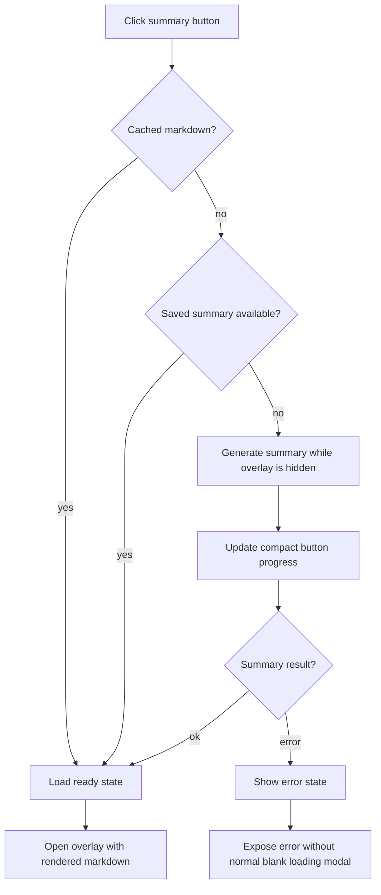

# fix: Restore deferred summary overlay launch

## Summary

Restore the YouTube summary button contract: fresh summary runs show progress on the compact page button, and the large overlay opens only when a cached, saved, or newly generated summary is ready. Keep Safari's browser-direct OpenRouter path working without letting Safari-specific native-host limitations change the shared UI lifecycle.

---

## Problem Frame

The README promises that the large modal opens only after the summary is ready, so the user does not see a half-loaded panel. After Safari support was added, clicking the summary button now opens the overlay immediately, because the YouTube content script unhides the overlay before it knows whether a cached summary exists or fresh generation is needed.

Safari compatibility is not the core issue. The bug is that overlay visibility is controlled too early in the click lifecycle while the extension now has more backend modes: Chrome/Brave native host, Safari/browser-direct OpenRouter, cache hit, saved-summary hit, and error.

---

## Requirements

- R1. On a fresh YouTube summary run with no cached summary and no existing saved summary, clicking the page summary button or toolbar action must keep the large overlay hidden until summary markdown is available.
- R2. During lookup and fresh generation, progress or status must remain visible through the compact page button, including checking-cache/checking-saved-summary states and generation states such as `5%`, `10%`, `35%`, `50%`, `65%`, `78%`, `90%`, and `100%`.
- R3. Cache hits and existing saved-summary hits may open the overlay immediately, because ready markdown already exists.
- R4. Errors during fresh generation must open only an explicit error state or remain on the compact button; they must not show a blank, stale, or half-loaded summary body as the normal loading state.
- R5. Browser-direct mode must be treated as a backend capability, not a Safari identity; local Obsidian lookup is skipped only when native-host lookup is unavailable or explicitly bypassed by that capability.
- R6. Regression coverage must prove the overlay does not unhide early on cache-miss generation paths.
- R7. Cache persistence failure after successful summary generation must not block showing the generated markdown.

---

## High-Level Technical Design

The implementation should make overlay visibility a result of readiness, not the first action in the click handler.

This lifecycle applies to both the in-page summary button and the browser toolbar action that sends `OPEN_SUMMARY_OVERLAY`. Backend selection remains owned by the service worker; the content script should care only whether it received ready markdown, a full cache/saved-summary miss, or an error.

---

## Key Technical Decisions

- KTD1. Preserve the compact button as the fresh-run progress surface: this directly matches the documented behavior and avoids replacing the regression with a loading modal.
- KTD2. Split ready opens from generate opens: cached or existing summaries can open immediately, while fresh generation should call the same summary workflow with an open-when-ready policy.
- KTD3. Keep backend branching capability-based: browser-direct mode can return `found: false` only when native-host lookup is unavailable for that run; Chrome/Brave with a reachable native host should not lose existing saved-summary hits merely because a direct OpenRouter key is configured.
- KTD4. Add characterization-style tests around the content-script lifecycle before broadening the refactor: the visible bug is a DOM/state regression, so tests should prove overlay hidden/visible behavior with mocked runtime messages.

---

## Scope Boundaries

- In scope: YouTube summary overlay launch timing, page button progress behavior, cache/saved-summary open behavior, browser-direct/native-host lifecycle parity, and regression tests.
- Deferred to follow-up work: a larger backend capability adapter that explicitly reports `native-host`, `browser-direct`, or `unavailable`.
- Out of scope: changing the summary prompt, OpenRouter model defaults, Obsidian save format, Safari App Extension native messaging architecture, or webpage-summary overlay behavior unless implementation reveals shared helper fallout.

---

## Implementation Units

### U1. Characterize the deferred-open lifecycle

- **Goal:** Add focused tests that fail against the current premature-open behavior and capture the expected ready-only overlay opening behavior.
- **Requirements:** R1, R2, R3, R4, R6, R7.
- **Dependencies:** None.
- **Files:** Modify `tests/youtube-transcript-content.test.js`; optionally add `tests/youtube-overlay-lifecycle.test.js` if keeping the existing transcript test focused is cleaner.
- **Approach:** Use the existing Node `vm` style content-script test harness to mock the DOM, `chrome.runtime.sendMessage`, `chrome.storage.local`, timers, and transcript extraction inputs. Exercise cache miss, generation success, generation error, and cache hit paths through the public click/message handlers rather than extracting internals.
- **Execution note:** Start characterization-first so the current regression is proven before changing the content script.
- **Patterns to follow:** The existing `tests/youtube-transcript-content.test.js` loads `content/youtube-transcript.js` in a VM and asserts behavior through the registered message listener.
- **Test scenarios:**
  - Full miss, successful generation: clicking the page summary button with no cached summary and no existing saved summary does not unhide `#opita-youtube-summary-overlay` before the mocked `SUMMARIZE_AND_SAVE` response resolves with markdown.
  - Full miss, successful generation from toolbar action: receiving `OPEN_SUMMARY_OVERLAY` with no cached summary and no existing saved summary keeps the overlay hidden until markdown is ready.
  - Full miss, successful generation: the compact page button shows lookup and generation progress during cache/saved-summary checks, extraction, and summarization; the overlay opens after markdown is ready.
  - Cache hit: clicking opens the overlay immediately and renders the cached markdown.
  - Generation error: the normal loading path does not show an empty summary body as if it were ready; the user receives either compact-button error feedback or an overlay with an explicit error body and no stale summary.
  - Cache write failure after successful generation: the overlay still opens with generated markdown and surfaces cache-save failure as non-fatal status.
- **Verification:** The new lifecycle test fails before U2 and passes after U2 without weakening existing transcript extraction assertions.

### U2. Restore ready-only overlay visibility in the YouTube content script

- **Goal:** Change the YouTube summary flow so fresh generation keeps the overlay hidden until ready markdown exists.
- **Requirements:** R1, R2, R3, R4, R7.
- **Dependencies:** U1.
- **Files:** Modify `content/youtube-transcript.js`.
- **Approach:** Stop unhiding the overlay at the start of `showOverlay()`. Let cache and saved-summary hits call the ready rendering path and open the overlay. For full misses, invoke the generation path with the intended open-when-ready policy and keep lookup/generation progress on the compact button. Treat `writeCachedSummary()` as best-effort after markdown exists: render in-memory markdown even if cache persistence fails, and show cache-save failure as a warning rather than a terminal summary error.
- **Patterns to follow:** Reuse existing `readCachedSummary()`, `readExistingSavedSummary()`, `setProgress()`, `loadSummaryResult()`, `renderState()`, and `writeCachedSummary()` instead of creating a second summary flow.
- **Test scenarios:**
  - Fresh run with no cache and no existing saved summary keeps `overlay.hidden` true through lookup, extraction, and the `35%` progress phase.
  - Fresh run opens the overlay after the mocked summary response includes markdown and category.
  - Existing saved-summary result still opens the overlay without starting a new summary request.
  - A failed summary request leaves the compact button in an error state or opens a dedicated error overlay without rendering stale markdown.
  - A successful summary response followed by storage failure still renders markdown and records a non-fatal cache warning.
- **Verification:** Content-script lifecycle tests pass, and `node --check content/youtube-transcript.js` reports no syntax errors.

### U3. Keep Safari/browser-direct behavior aligned with the restored lifecycle

- **Goal:** Ensure the service-worker direct OpenRouter path and native-host path both satisfy the content script's ready/error expectations without treating browser-direct mode as synonymous with Safari.
- **Requirements:** R4, R5.
- **Dependencies:** U2.
- **Files:** Modify `background/service-worker.js` only if needed; inspect `content/youtube-transcript.js` message handling for assumptions about `saveMode`, `path`, and `found`.
- **Approach:** Prefer native-host saved-summary lookup when the native host is reachable, even if a direct OpenRouter key is configured. Browser-direct can return `{ ok: true, found: false, saveMode: 'browser-direct' }` only when the native host is unavailable or intentionally bypassed for that run. Revisit the short saved-summary lookup timeout now that the overlay is hidden during lookup: the compact button should show checking progress while native lookup gets an explicit acceptable timeout, and browser-direct can still miss quickly when native lookup is unavailable. Do not add a full capability adapter in this fix.
- **Patterns to follow:** `summarizeBestAvailable()` already selects direct OpenRouter when a direct key is configured and native messaging otherwise.
- **Test scenarios:**
  - Browser-direct saved-summary miss continues into generation without opening a blank overlay.
  - Browser-direct successful summary with empty `path` still opens the ready overlay and caches markdown.
  - Native-host saved-summary lookup failure or timeout does not set the overlay visible as a loading workaround.
  - Native-host saved-summary lookup that resolves within the accepted timeout opens the ready overlay and does not start fresh generation.
- **Verification:** If `background/service-worker.js` changes, add or update a lightweight service-worker contract test for `FIND_EXISTING_SUMMARY` and `SUMMARIZE_AND_SAVE` response shapes with mocked Chrome/native APIs; otherwise document that no service-worker contract changed. Any changed service-worker code must pass `node --check`.

### U4. Update docs and run the verification bundle

- **Goal:** Keep documentation and local verification aligned with the restored behavior.
- **Requirements:** R1, R2, R3, R6.
- **Dependencies:** U1, U2, U3.
- **Files:** Modify `README.md` only if implementation changes wording around Safari/browser-direct mode; modify or add tests under `tests/`.
- **Approach:** The README already states the desired deferred-open behavior, so avoid churn unless the implementation adds a notable Safari-specific limitation. Run the focused Node tests and syntax checks over changed JavaScript files.
- **Patterns to follow:** Prior repo memory recommends focused tests and syntax checks for this extension rather than relying on the noisy parent Chromium diff.
- **Test scenarios:**
  - Existing `tests/summarizer.test.js` still passes.
  - Existing `tests/youtube-transcript-content.test.js` still passes.
  - New lifecycle coverage passes.
  - Changed JavaScript files pass syntax checks.
  - Manual or automated browser smoke confirms a cleared/no-cache YouTube watch page keeps the overlay hidden through at least the `35%` phase, then opens after success; a repeat cached click opens immediately.
- **Verification:** Local test output demonstrates that the lifecycle regression is covered and all changed JavaScript parses. Runtime smoke should reload the unpacked extension before checking behavior; if Safari cannot be automated in this pipeline, mark Safari runtime verification as manual and verify the Chrome/Brave extension surface that uses the same content script.

---

## Acceptance Examples

- AE1. Given a YouTube watch page with no cached summary and no existing saved summary, when the user clicks the page button or toolbar action, then the large overlay remains hidden while the compact button progresses through lookup and summary states.
- AE2. Given a fresh summary request succeeds, when the extension receives markdown, then the overlay opens and renders the completed summary.
- AE3. Given a cached summary exists for the current video, when the user clicks the summary button, then the overlay opens immediately with the cached summary.
- AE4. Given browser-direct mode cannot scan local Obsidian files for the current run, when saved-summary lookup returns `found: false`, then the extension continues hidden generation instead of opening a blank modal.

---

## Risks & Dependencies

- The content script is large and not structured as importable modules, so lifecycle tests may need VM-level DOM and Chrome API mocks.
- Existing working-tree changes predate this plan; implementation must avoid reverting unrelated edits.
- Safari runtime verification may not be fully automatable in this pipeline, so DOM-level lifecycle tests should be treated as the durable regression guard.

---

## Sources & Research

- `README.md` documents the expected progress and deferred overlay behavior.
- `content/youtube-transcript.js` currently owns the page button, overlay rendering, cache lookup, and summary run lifecycle.
- `background/service-worker.js` currently owns native-host versus browser-direct summary execution.
- `tests/youtube-transcript-content.test.js` provides the existing VM-based content-script test pattern.
- `docs/ideation/2026-06-16-safari-summary-button-launch-lifecycle-ideation.html` ranked the ready-only overlay restoration as the strongest direction.
- Apple Safari Web Extensions documentation frames Safari support as a web-extension compatibility layer, while Safari native-app messaging is a separate app-extension integration boundary.
